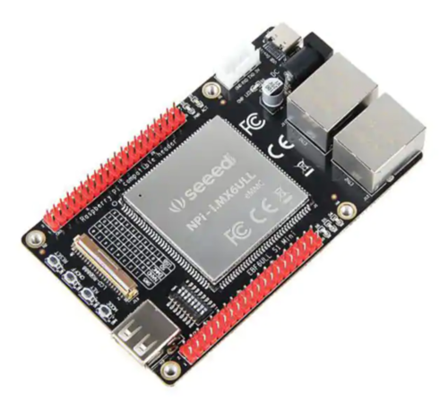

# NPi i.MX6ULL Support

*This is a work in progress. It currently boots off MicroSD cards and not eMMC*

[](https://circleci.com/gh/fhunleth/nerves_system_npi_imx6ull)
[](https://hex.pm/packages/nerves_system_npi_imx6ull)

This is the base Nerves System configuration for the [NPi
i.MX6ULL](https://www.digikey.com/product-detail/en/seeed-technology-co-ltd/102991306/1597-102991306-ND/10492211).


<br><sup>[Image credit](#digikey)</sup>

| Feature              | Description                     |
| -------------------- | ------------------------------- |
| CPU                  | 800 MHz ARM Cortex-A7           |
| Memory               | 512 MB DRAM                     |
| Storage              | 8 GB eMMC Flash and MicroSD     |
| Linux kernel         | 4.19 w/ RCN patches             |
| IEx terminal         | UART `ttymxc0`                  |
| GPIO, I2C, SPI       | Yes - [Elixir Circuits](https://github.com/elixir-circuits) |
| Display              | Yes, but not supported yet      |
| ADC                  | Yes                             |
| PWM                  | Yes, but no Elixir support      |
| UART                 | ttymxc0                         |
| Camera               | None                            |
| Ethernet             | Two 100 Mbps (eth0 and eth1)    |
| WiFi                 | Requires USB WiFi dongle/driver |
| RTC                  | Yes w/ battery                  |
| HW Watchdog          | i.MX6 watchdog enabled on boot. Be sure to enable `heart` in your vm.args or the device will reboot |

WARNING: 32 GB and larger MicroSD cards don't seem to work!

## Using

This port currently only runs off a MicroSD card. It has not been updated to
support eMMC usage. If you're interested, please see
[#1](https://github.com/fhunleth/nerves_system_npi_imx6ull/issues/1). Because of
this, you'll need to modify the boot select switches to `SD` boot (It's
`01001001`, but see legend on PCB)

The most common way of using this Nerves System is create a project with `mix
nerves.new` and add `npi_imx6ull` references where needed and in a similar way
to the default systems like `bbb`, etc. Then export `MIX_TARGET=npi_imx6ull`.
See the [Getting started
guide](https://hexdocs.pm/nerves/getting-started.html#creating-a-new-nerves-app)
for more information.

If you need custom modifications to this system for your device, clone this
repository and update as described in [Making custom
systems](https://hexdocs.pm/nerves/systems.html#customizing-your-own-nerves-system)

## Console access

The console is configured to output to the 4-pin white header near the power
connectors. A 3.3V FTDI cable is needed to access the output.

In theory, the console could be routed to the display. The display hasn't been
enabled. See
[#2](https://github.com/fhunleth/nerves_system_npi_imx6ull/issues/2).

If you would like console access via the LCD, you will need to enable LCD
support in the Linux kernel, and change `erlinit.conf` to output to `tty1`.

## Networking

The board has two 100 Mbps Ethernet interfaces. Here's an example `:vintage_net`
configuration that enables both of them:

```elixir
config :vintage_net,
  config: [
    {"eth0",
     %{
       type: VintageNetEthernet,
       ipv4: %{method: :dhcp}
     }},
    {"eth1",
     %{
       type: VintageNetEthernet,
       ipv4: %{method: :dhcp}
     }}
  ]
```

## Linux and U-Boot versions

The NPi i.MX6ULL vary by kernel version and patch set. Nerves tracks those
maintained by Robert Nelson at
[eewiki.net](https://www.digikey.com/eewiki/display/linuxonarm/NPi+i.MX6ULL)

Nerves also integrates the NPi i.MX6ULL's U-boot patches but modifies them to
support the Nerves U-Boot environment variables.

[Image credit](#digikey): This image is from [Digikey](http://digikey.com/).

